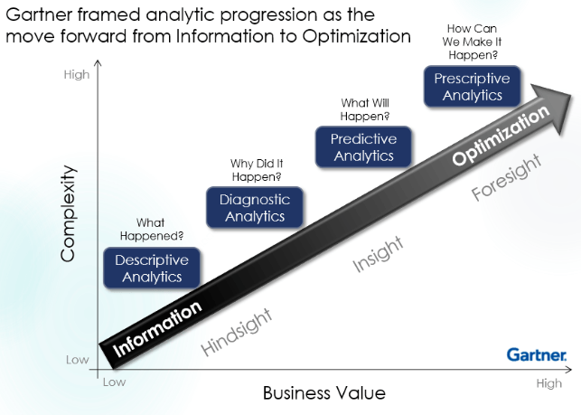

```{r setup, include=FALSE}
knitr::opts_chunk$set(echo = TRUE,
                      warning = FALSE)
```

## 1. Theoretical Background

**Introduction to Predictive Analytics**

Predictive analytics is the branch of advanced analytics that uses historical data, statistical algorithms, and machine learning techniques to identify the likelihood of future outcomes. Unlike **descriptive analytics** (which tells us what happened), predictive analytics seeks to provide the best assessment of what will happen next.

The general workflow involves:

- **Data Preparation**: Cleaning and handling missing values.
- **Exploratory Data Analysis (EDA)**: Understanding correlations and distributions.
- **Model Training**: Using a subset of data to "teach" the algorithm.
- **Validation/Testing**: Evaluating performance on unseen data.




## Regression Analysis

Regression is a supervised learning technique used when the target variable (Dependent Variable) is continuous (e.g., housing prices, temperature, or sales). The goal is to find a mathematical relationship between the predictors (Independent Variables) and the target.

- **Linear Regression**: Assumes a linear relationship ($Y = \beta_0 + \beta_1X + \epsilon$).
- **Stepwise Regression**: An automated process of adding or removing variables to find the most statistically significant model based on criteria like AIC or Adjusted $R^2$.

## 1. General Steps in a Machine Learning Project

Every predictive analytics project generally follows these six phases:

- **Problem Definition**: Identifying the target variable (e.g., What is the house price?) and the predictors (e.g., Size, Location, Crime rate).
- **Data Acquisition & Cleaning**: Importing data and handling anomalies like missing values (`NA`s) or outliers.
- **Exploratory Data Analysis (EDA)**: Using statistics and visualizations (like correlation heatmaps) to find relationships between variables.
- **Feature Engineering & Selection**: Deciding which variables are most important and transforming them (e.g., scaling for Neural Networks).
- **Model Training & Hyperparameter Tuning**: Running algorithms (Linear Regression, Ridge, Lasso) and finding the best settings (e.g., the $\lambda$ in Ridge).
- **Model Evaluation**: Testing the model on unseen data to ensure it generalizes well to the real world.

## 2. Understanding Data Partitioning

One of the most critical steps is splitting your data. If you test your model on the same data used to train it, the model will "memorize" the answers (**Overfitting**) rather than "learning" the patterns.

**The Three Samples:**

- **Training Sample** (typically 70-80%): You can think of it like the "textbook" for the algorithm. The model looks at this data to find patterns and adjust its internal weights.
- **Validation Sample** (optional, often part of Cross-Validation): Used to tune "hyperparameters." It acts as a practice exam to see which version of the model performs best before the final test.
- **Test Sample** (typically 20-30%): The "final exam." This data is kept in a "vault" and only shown to the model once it is finished training. It provides an unbiased evaluation of the model's performance.

## 3. Regression Implementation: From OLS to Regularization

Here is the code with detailed annotations, including the requested VIF, Ridge, and Lasso implementations.

```{r}
# 0. Load required libraries ---- 
library(caret)     # ML workflow (training, splitting, CV)
library(tidyr)     # Data cleaning (replace_na)
library(ggcorrplot)# Correlation visualization
library(car)       # For VIF calculation
library(glmnet)    # For Ridge and Lasso regression
```

- **Step 1: a) Read and Clean Data**

```{r}
# 1. Read and Clean Data ----
file_name <- paste0(getwd(), "/06_Regression_Boston_Housing_Prices.csv")
housing <- read.csv(file_name)

# Identify and replace missing values with 0
# Logic: We replace NAs to prevent the model from dropping rows entirely.
housing$CRIM   <- replace_na(housing$CRIM, 0)
housing$ZN     <- replace_na(housing$ZN, 0)
housing$INDUS  <- replace_na(housing$INDUS, 0)
housing$CHAS   <- replace_na(housing$CHAS, 0)
housing$AGE    <- replace_na(housing$AGE, 0)
housing$LSTAT  <- replace_na(housing$LSTAT, 0)

```

- **Step 1: b) --- Exploratory Data Analysis (EDA) ---**

```{r}
# Correlation matrix to see which IVs affect MEDV (Price)
correlation_matrix <- cor(housing)
ggcorrplot(correlation_matrix, method = "square", lab = TRUE, digits = 1, type = "lower")

```

- **Step 2: Training and Test Split**

```{r}
# 2. Training and Test Split ----
set.seed(1234) # For reproducibility
train_test_vector <- sample(c("Training", "Testing"), 
                            nrow(housing), 
                            replace = TRUE, 
                            prob = c(0.7, 0.3))

train <- housing[train_test_vector == "Training", ]
test  <- housing[train_test_vector == "Testing", ]
```

- **Step 3: Model Building & Multicollinearity**

```{r}
# 3. Model Building & Multicollinearity ----

# A. Standard Linear Regression (OLS)
# OLS is implemented using caret package for consistency later. Commenting that code here and keeping it for reference only
lm_model <- lm(MEDV ~ ., data = train)   

# B. VIF (Variance Inflation Factor) check
# VIF > 5-10 indicates high multicollinearity (IVs are too correlated with each other)
vif_results <- vif(lm_model)
print(vif_results)
```

- **Step 4: Implementing various models**
- **Step 4. a) Stepwise Regression (Forward Selection)**

```{r}
# 4. a) Stepwise Regression (Forward Selection)
min_model <- lm(MEDV ~ 1, data = train)
max_model <- step(min_model, 
                  scope = (~ CRIM + ZN + INDUS + CHAS + NOX + RM + AGE + 
                             DIS + RAD + TAX + PTRATIO + B + LSTAT),
                  direction = "forward", trace = 0)

```

- **Step 4. b) Cross-Validation & Regularization (Ridge/Lasso)**
```{r}
# 4. b) Cross-Validation & Regularization (Ridge/Lasso) ----

# Set up 10-fold Cross-Validation
training_params <- trainControl(method = "repeatedcv", 
                                number = 10, repeats = 5, 
                                verboseIter = FALSE)
```

- **Step 4. c) Ridge Regression (Alpha = 0)**

```{r}
# 4. c) Ridge Regression (Alpha = 0)
# Penalizes large coefficients to handle multicollinearity.

set.seed(1234)
ridge_model <- train(MEDV ~ ., data = train, method = "glmnet",
                     tuneGrid = expand.grid(alpha = 0, 
                                            lambda = seq(0, 5, length = 50)),
                     trControl = training_params)
```

- **Step 4. d) Lasso Regression (Alpha = 1)**
```{r}
# 4. d) Lasso Regression (Alpha = 1)
# Can shrink coefficients to zero (Feature Selection).
set.seed(1234)
lasso_model <- train(MEDV ~ ., data = train, method = "glmnet",
                     tuneGrid = expand.grid(alpha = 1, 
                                            lambda = seq(0.001, 0.5, length = 50)),
                     trControl = training_params)
```

- **Step 5: Model Comparison**

```{r}
# 5. Model Comparison ----
# Including the basic lm() model. Recreated for caret package standards.
lm_model <- train(MEDV ~ ., 
                        data = train, 
                        method = "lm", 
                        trControl = training_params)

# Compare RMSE and R-squared from the training phase
results <- resamples(list(Linear = lm_model, Ridge = ridge_model, Lasso = lasso_model))
summary(results)
```

- **Step 6: Now is the time to test on unseen sample (Test)**

```{r}
# Final performance check on the unseen TEST data
pred_linear <- predict(lm_model, test)
pred_ridge  <- predict(ridge_model, test)
pred_lasso  <- predict(lasso_model, test)

# Function to calculate RMSE for comparison
calc_rmse <- function(actual, predicted) { sqrt(mean((actual - predicted)^2)) }

# Result Table
comparison_table <- data.frame(
  Model = c("Linear", "Ridge", "Lasso"),
  RMSE  = c(calc_rmse(test$MEDV, pred_linear),
            calc_rmse(test$MEDV, pred_ridge),
            calc_rmse(test$MEDV, pred_lasso))
)
print(comparison_table)
```

- **Step 7: Final Leaderboard Visualization**
> Final "Leaderboard" Visualization
To truly see which model won, you can use the dotplot function. This creates a visual comparison of the performance across all 10 folds of your cross-validation.

```{r}
# Visual comparison of RMSE
dotplot(results, metric = "RMSE", main = "Model Comparison: RMSE")

# Visual comparison of R-Squared
dotplot(results, metric = "Rsquared", main = "Model Comparison: R-Squared")
```

## 4. Moving Toward Neural Networks

Before we jump into the code for Neural Networks, it is important to understand the concept of a "Black Box" model.

While Linear Regression gives us clear coefficients (e.g., "For every room added, price increases by $5,000"), Neural Networks find complex, non-linear relationships that are harder to explain but often more accurate for messy data.

### 1. The Architecture: Layers and Neurons

A Neural Network is composed of three main types of layers. Each "neuron" in these layers is essentially a mathematical function.

- **The Input Layer**: Each neuron here represents one of your features (e.g., `CRIM`, `RM`, `TAX`). It passes the raw data into the network.
- **The Hidden Layers**: This is the "brain." Here, the network creates new, abstract features by combining inputs. For example, one hidden neuron might combine `RM` (rooms) and `LSTAT` (status) to create a "luxury-affordability" index that wasn't in your original data.
- **The Output Layer**: For regression (like our Boston Housing data), this is usually a single neuron that spits out the final predicted value (`MEDV`).

### 2. The Mechanics: How it "Learns"

Neural Networks learn through a process of trial and error using two main steps:

#### A. Forward Propagation (The Guess)

The data flows from left to right. Each connection between neurons has a **Weight** ($w$) and a **Bias** ($b$).  
- Weights determine the strength of a signal (importance).  
- **Activation Functions** (like Sigmoid or ReLU) decide if a neuron should "fire" or pass information along. It introduces non-linearity, allowing the model to learn relationships that aren't just straight lines.

#### B. Backpropagation (The Correction)

After the network makes a guess, it compares that guess to the actual price. It calculates the **"Loss"** (the error).  
The network then works backward from the output to the input, slightly adjusting every weight and bias to reduce the error for the next round.  
This is controlled by the **Learning Rate**. If the rate is too high, the model overshoots; if it’s too low, it takes forever to learn.

### 3. Why use NN over Regression?

| Feature          | Linear Regression                                                                 | Neural Network                                                                                   |
|------------------|------------------------------------------------------------------------------------|--------------------------------------------------------------------------------------------------|
| **Relationship** | Assumes $Y$ changes at a constant rate with $X$.                                   | Can model "U-shapes," exponential growth, or sudden jumps.                                      |
| **Interactions** | You must manually tell R to look at `RM * TAX`.                                    | Automatically discovers interactions between variables.                                         |
| **Interpretability** | High (you see the exact impact of each variable).                                  | Low (it's hard to explain why a specific weight is 0.42).                                       |
| **Data Size**    | Works well on small datasets.                                                      | Requires more data to avoid "memorizing" noise (**Overfitting**).                               |

### 4. Why Scaling is Mandatory

In the code, we used `scale()`. Imagine one variable is `AGE` (0 to 100) and another is `TAX` ($200 to $700).  
If we don't scale them, the Neural Network will think the `TAX` variable is 7 times more important just because the numbers are larger. By squishing everything between 0 and 1, we ensure a "level playing field" for all features.

- **Neural Net Step 0: Load the required libraries**
```{r}
library(nnet)
library(NeuralNetTools)
```

- **Neural Net Step 1: Scaling (A mandatory step)**
``` {r}
# 1. Scaling: Mandatory for Neural Networks
maxs <- apply(housing, 2, max) 
mins <- apply(housing, 2, min) 
housing_scaled <- as.data.frame(scale(housing, center = mins, scale = maxs - mins)) 
```

- **Neural Net Step 2: Train/Test Split on Scaled Data**
```{r}
# 2. Train/Test Split on Scaled Data
set.seed(1234)
train_idx <- sample(1:nrow(housing_scaled), 0.7 * nrow(housing_scaled))
train_nn  <- housing_scaled[train_idx, ]
test_nn   <- housing_scaled[-train_idx, ]
```

- **Neural Net Step 3: Train the model (Creating model with weights)**

```{r}
# 3. Train the Model
set.seed(1234)
nn_model <- nnet(MEDV ~ ., data = train_nn, size = 5, linout = TRUE, 
                 maxit = 500, decay = 0.01, trace = FALSE)
```

- **Neural Net Step 4: Interpret weights and Importance**

```{r}
# 4. Interpret Weights & Importance
plotnet(nn_model) # Visualizes the neurons and connections
garson(nn_model)  # Shows relative importance of variables
```

- **Neural Net Step 5: Predict the outcome and convert outcome to un-scaled Data**

```{r}
# 5. Predict and Un-scale
nn_pred_scaled <- predict(nn_model, test_nn)
nn_pred_actual <- nn_pred_scaled * (maxs["MEDV"] - mins["MEDV"]) + mins["MEDV"]
actual_values  <- test_nn$MEDV * (maxs["MEDV"] - mins["MEDV"]) + mins["MEDV"]
```

- **Neural Net Step 6: Capture Neural Net RSME**
```{r}
# Final Neural Net RMSE
nn_rmse <- calc_rmse(actual_values, nn_pred_actual)
print(paste("Neural Network Test RMSE:", round(nn_rmse, 4)))
```

- **Will increasing the "depth" (making it the real deep learning) of the network by adding more hidden layers would improve the $R^2$ score? Let's See**

To increase the "depth" of a Neural Network, we move from a simple Artificial Neural Network (ANN) toward Deep Learning. In the `nnet` package, we are limited to a single hidden layer, but we can increase the size (number of neurons). If we want to add multiple layers, we typically transition to packages like `neuralnet` or `keras`. Let's safely assume that we are doing deep learning, however, we are infact doing wide learning!

Since we are already using `nnet` and `caret`, let's see how adding more "neurons" to that single layer changes the model's ability to capture the complexities of the Boston Housing data.

## 1. The Theory of "Deep" vs. "Wide"

- **A "Wide" Network** (Increasing *size*): Adding more neurons to one layer allows the model to memorize more specific patterns in the data. However, if it's too wide, it might overfit (memorize the noise).

- **A "Deep" Network** (Adding *layers*): Adding more layers allows the model to learn "features of features." For example, Layer 1 might learn about "Room Size," and Layer 2 might combine that with "Crime Rate" to learn about "Neighborhood Safety."

```{r}
# 1. Define the Grid
# We will test 5, 10, and 15 neurons in the hidden layer
# We will also test different 'decay' values (regularization to prevent overfitting)
nn_grid <- expand.grid(size = c(5, 10, 15), 
                       decay = c(0.1, 0.01, 0.001))

# 2. Train using Caret (This handles the scaling internally if we use preProcess)
set.seed(1234)
deep_nn_model <- train(MEDV ~ ., 
                       data = train_nn, 
                       method = "nnet", 
                       tuneGrid = nn_grid,
                       trControl = training_params,
                       linout = TRUE, # Required for Regression
                       trace = FALSE, 
                       maxit = 1000)

# 3. View the best combination
print(deep_nn_model$bestTune)

# 4. Compare with your previous models
results_all <- resamples(list(Linear = lm_model, 
                              Ridge = ridge_model, 
                              Lasso = lasso_model,
                              NeuralNet = deep_nn_model))
summary(results_all)
```

- **A note on visualizing the network**

## 3. Visualizing the Result

When the network gets more complex, the `plotnet()` diagram becomes very dense. You will see many more "synapses" (lines) connecting the inputs to the hidden neurons.

You should notice that as the model gets more complex:

- **Training Error** usually goes down.
- **Validation Error** might start to go up if the model is too "deep" for the amount of data we have (this is the "Overfitting" trap).

## 4. Summary of the Regression Journey

We have now covered:

- **Simple Linear Regression**: The baseline.
- **Stepwise Regression**: Automated variable selection.
- **Ridge/Lasso**: Handling multicollinearity and complexity.
- **Neural Networks**: Capturing non-linear "Black Box" patterns.

## Upcoming Topics

- **Classification**: Used when the target is categorical (e.g., "Yes" or "No").
- **Clustering**: An unsupervised technique used to find hidden patterns or groupings in data without pre-defined labels.
